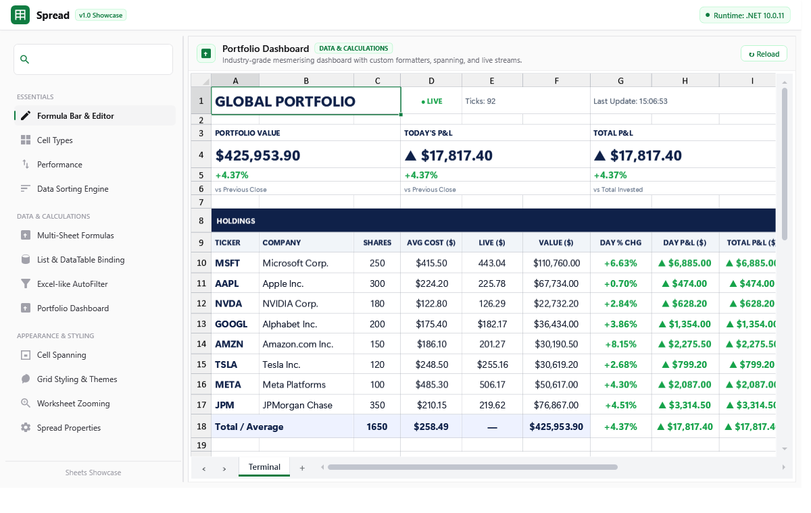
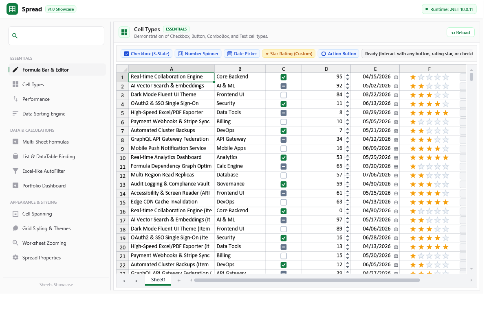
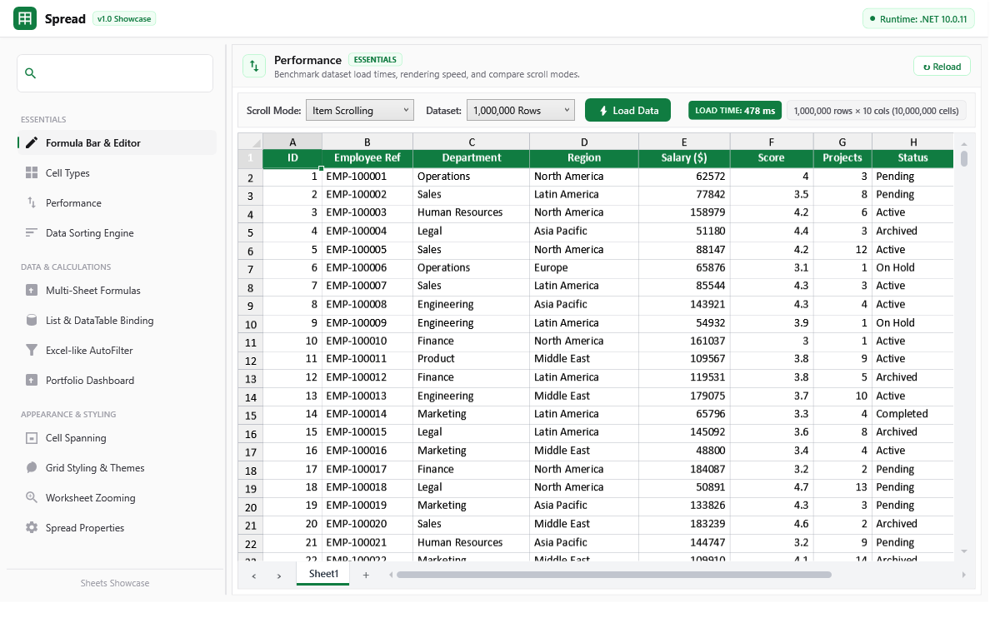
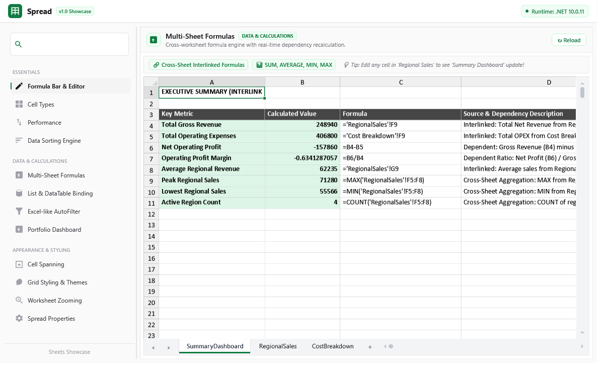
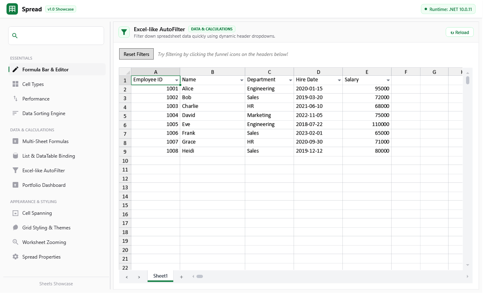
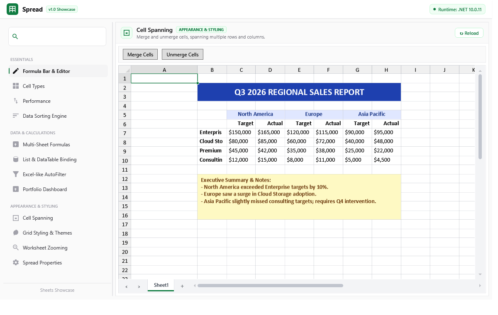
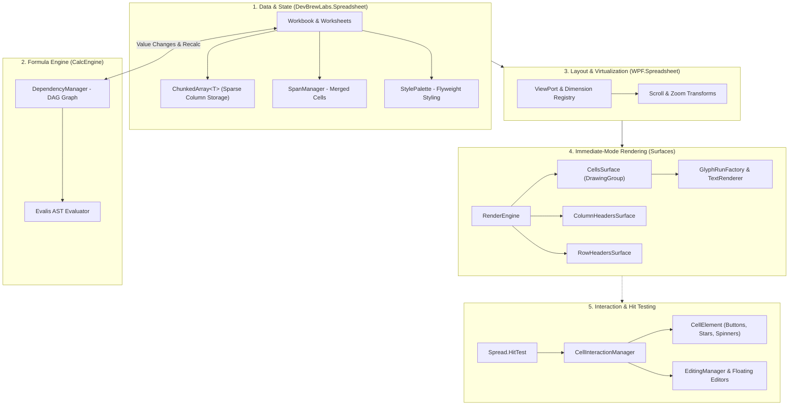

# DevBrewLabs.Spreadsheet

<p align="center">
  <b>A high-performance, virtualized WPF spreadsheet and calculation engine built for massive scale, rich cell interactions, and deep extensibility.</b>
</p>

<p align="center">
  <a href="https://dotnet.microsoft.com/"></a>
  <a href="https://dotnet.microsoft.com/"></a>
  <a href="https://github.com/kartikdeepsagar/AlphaX.WPF.Sheets"></a>
  <a href="LICENSE"></a>
</p>

---

## Overview

**DevBrewLabs.Spreadsheet** is a lightweight, high-speed WPF spreadsheet component and multi-sheet formula calculation engine. Standard WPF grids and legacy spreadsheet controls often suffer from heavy visual tree overhead, memory bloat, sluggish scroll latency, and rigid cell structures when handling complex enterprise data.

This project solves those limitations by pairing a **platform-agnostic core data engine** with an **immediate-mode DirectWrite/GlyphRun WPF renderer**. It eliminates per-cell visual element overhead, allowing millions of cells to render, scroll, and recalculate with sub-second performance and smooth 60 FPS responsiveness.



### Key Highlights
- **Engineered for Scale**: Block-allocated chunked arrays (`ChunkedArray<T>`) prevent Large Object Heap (LOH) fragmentation when hosting millions of data points.
- **Immediate-Mode WPF Rendering**: Directly draws cells, borders, and text via `DrawingGroup` and `GlyphRun` pipelines rather than instantiating WPF visual tree elements.
- **Interactive Cell Sub-Elements**: Full hit-testing and event routing for in-cell controls (buttons, rating stars, number spinners, checkboxes, date pickers, dropdown lists) without WPF control tree penalties.
- **Multi-Sheet Formula Dependency Graph**: Built-in formula engine with cross-sheet referencing, automatic dependency resolution, and real-time reactive recalculation.
- **Clean Separation of Concerns**: Headless core (`DevBrewLabs.Spreadsheet`), calculation engine (`DevBrewLabs.Spreadsheet.CalcEngine`), and presentation layer (`DevBrewLabs.WPF.Spreadsheet`).

---

## Features

### ⚡ High-Performance Virtualization & Rendering
- **Immediate-Mode Direct Drawing**: Bypasses WPF `Visual` hierarchy by rendering directly to dedicated surface `DrawingGroup` layers (`CellsSurface`, `RowHeadersSurface`, `ColumnHeadersSurface`, `TopLeftSurface`).
- **Low-Level GlyphRun Text Engine**: Custom `TextRenderer` and `GlyphRunFactory` with character analysis, pixel snapping (`PixelSnapper`), and trimming (`EllipsisEngine`) for ultra-sharp typography.
- **Dual Scrolling Modes**: Support for both standard item-based scrolling and smooth sub-cell pixel scrolling (`SheetScrollMode.Pixel` / `SheetScrollMode.Item`).
- **Arbitrary Sheet Zooming**: Smooth fractional zooming from 50% to 400% with automatic DPI and sub-element coordinate transforms.

### 🧮 Calculation Engine & Data Operations
- **Cross-Sheet Formulas**: Multi-sheet formula evaluation (e.g. `=SUM(Sheet2!B4:E4)`, `=AVERAGE('Regional Sales'!C2:C50)`) powered by `DevBrewLabs.Evalis`.
- **Reactive Dependency Resolution**: Directed acyclic graph (DAG) dependency manager (`DependencyManager`) that recalculates affected cells automatically on value changes.
- **Excel-Style AutoFilter**: Column header filter buttons (`FilterButton`) with condition builder dropdowns and dynamic value filtering.
- **Natural Multi-Column Sorting**: High-speed sorting engine supporting ascending/descending multi-level ranges and natural alphanumeric comparison (`NaturalSortComparer`).

### 🎨 Cell Types & Rich Interactions
- **Built-in Cell Types**:
  - `TextCellType`: High-speed formatted text with alignment, multiline, and trimming options.
  - `NumberCellType`: Numeric formatting with integrated increment/decrement spinners and min/max limits.
  - `CheckBoxCellType`: Two-state and three-state interactive checkboxes.
  - `ComboBoxCellType`: Dropdown selection lists with custom items source, display/value mappings, and search/selection popup.
  - `ButtonCellType`: Push buttons with hover/pressed states and command binding.
  - `DateCellType`: Formatted date rendering with interactive calendar picker popup dropdowns.
- **Interactive Cell Sub-Elements (`CellElement`)**: Lightweight visual and clickable sub-elements inside cells with independent bounding boxes, hover states, mouse events, and cursor switching.
- **Cell Merging & Spanning**: Arbitrary row and column span merging (`SpanManager`) with automatic layout recalculation and boundary clipping.
- **Flyweight Style Architecture**: Style palette pooling (`StylePalette`) sharing brush and font definitions across millions of cells.

### ✏️ Editing, Selection & Workflow
- **In-Place Editors**: Floating cell editors (`TextCellEditor`, `NumericCellEditor`, `DateCellEditor`, `ComboBoxCellEditor`) positioned precisely over active cells.
- **Formula Bar Component**: Standalone `FormulaTextBox` control that links to the active spreadsheet selection with formula autocompletion suggestions.
- **Rich Selection Model**: Multi-cell range selection, whole-row/whole-column selection, range drag-and-drop, and Excel-style fill handle.
- **Undo / Redo Stack**: Comprehensive `UndoRedoManager` tracking cell value changes, range pastes, dimension resizing, and span modifications.
- **Two-Way Data Binding**: Direct binding to custom object lists (`IList<T>` via `PropertyDataMap`) or ADO.NET tables (`DataTable` via `DataColumnDataMap`).

---

## Showcase

| Real-Time Financial Dashboard | Interactive Cell Types & Elements |
| :---: | :---: |
|  |  |
| *Streaming live market updates, custom KPI cards, and trend formatters* | *Star ratings, action buttons, 3-state checkboxes, and spinners* |

| Extreme Scale (1,000,000 Rows) | Multi-Sheet Formula Dependencies |
| :---: | :---: |
|  |  |
| *10,000,000 cells virtualized with sub-second engine load time* | *Cross-sheet formulas with real-time recalculation graph* |

| Excel-Style AutoFilter | Hierarchical Spanning & Reporting |
| :---: | :---: |
|  |  |
| *Dynamic column header dropdown filtering and predicate evaluation* | *Multi-level merged headers and executive reporting structures* |

---

## Quick Start

### Requirements
- **.NET 8.0, 9.0, 10.0** (Windows) or **.NET Framework 4.7.2**
- **WPF** desktop application project

### 1. Declare in XAML
Add the XML namespace and embed the `Spread` control:

```xml
<Window x:Class="SpreadDemo.MainWindow"
        xmlns="http://schemas.microsoft.com/winfx/2006/xaml/presentation"
        xmlns:x="http://schemas.microsoft.com/winfx/2006/xaml"
        xmlns:sheets="http://schemas.devbrewlabs.com/2026/wpf/spreadsheet"
        Title="Spreadsheet Demo" Height="650" Width="1000">
    <Grid Margin="12">
        <Grid.RowDefinitions>
            <RowDefinition Height="Auto"/>
            <RowDefinition Height="*"/>
        </Grid.RowDefinitions>

        <!-- Optional Linked Formula Bar -->
        <Border Grid.Row="0" Margin="0,0,0,8" Padding="6,4" Background="#FAFAFA" BorderBrush="#E4E4E7" BorderThickness="1" CornerRadius="4">
            <sheets:FormulaTextBox Spread="{Binding ElementName=SpreadControl}" />
        </Border>

        <!-- Spreadsheet Control -->
        <Border Grid.Row="1" BorderBrush="#E4E4E7" BorderThickness="1" CornerRadius="4">
            <sheets:Spread x:Name="SpreadControl"
                           ScrollMode="Pixel"
                           AllowFiltering="True"
                           AllowColumnResize="True"
                           AllowRowResize="True" />
        </Border>
    </Grid>
</Window>
```

### 2. Populate and Style Data in C#

```csharp
using System;
using DevBrewLabs.Spreadsheet;
using DevBrewLabs.Spreadsheet.Drawing;
using DevBrewLabs.Spreadsheet.Styling;
using DevBrewLabs.WPF.Spreadsheet.CellTypes;

public partial class MainWindow : Window
{
    public MainWindow()
    {
        InitializeComponent();
        InitializeSpreadsheet();
    }

    private void InitializeSpreadsheet()
    {
        // Access active worksheet
        var sheet = SpreadControl.WorkBook.WorkSheets[0];
        sheet.RowCount = 100;
        sheet.ColumnCount = 6;

        // Configure Column Headers & Widths
        sheet.ColumnHeaders.Cells[0, 0].Value = "ID";
        sheet.ColumnHeaders.Cells[0, 1].Value = "Product Name";
        sheet.ColumnHeaders.Cells[0, 2].Value = "Unit Price";
        sheet.ColumnHeaders.Cells[0, 3].Value = "Quantity";
        sheet.ColumnHeaders.Cells[0, 4].Value = "Total";
        sheet.ColumnHeaders.Cells[0, 5].Value = "In Stock";

        sheet.Columns[1].Width = 200;
        sheet.Columns[2].Width = 120;
        sheet.Columns[3].Width = 100;
        sheet.Columns[4].Width = 130;
        sheet.Columns[5].Width = 90;

        // Assign Specialized Cell Types
        sheet.Columns[3].CellType = new NumberCellType { ShowSpinners = true, Minimum = 0, Maximum = 1000, Step = 1 };
        sheet.Columns[5].CellType = new CheckBoxCellType { IsThreeState = false };

        // Populate Values and Dependent Formulas
        sheet.Cells[0, 0].Value = 101;
        sheet.Cells[0, 1].Value = "Mechanical Keyboard";
        sheet.Cells[0, 2].Value = 129.99;
        sheet.Cells[0, 3].Value = 5;
        sheet.Cells[0, 4].Formula = "C1 * D1";
        sheet.Cells[0, 5].Value = true;

        sheet.Cells[1, 0].Value = 102;
        sheet.Cells[1, 1].Value = "4K Gaming Monitor";
        sheet.Cells[1, 2].Value = 449.50;
        sheet.Cells[1, 3].Value = 2;
        sheet.Cells[1, 4].Formula = "C2 * D2";
        sheet.Cells[1, 5].Value = true;

        // Apply Custom Styling
        var highlightStyle = new CellStyle
        {
            BackColor = DrawingColor.FromArgb(255, 240, 253, 244),
            FontWeight = DrawingFontWeight.Bold,
            ForeColor = DrawingColor.FromArgb(255, 16, 124, 65)
        };
        sheet.Cells[0, 4].Style = highlightStyle;
        sheet.Cells[1, 4].Style = highlightStyle;
    }
}
```

### 3. Two-Way Data Binding
Bind business collections or database tables directly:

```csharp
using DevBrewLabs.Spreadsheet.Data;

var customers = GetCustomerList(); // List<Customer>
var worksheet = SpreadControl.WorkBook.WorkSheets[0];

worksheet.DataSource = customers;
worksheet.Columns[0].DataMap = new PropertyDataMap("Id");
worksheet.Columns[1].DataMap = new PropertyDataMap("FullName");
worksheet.Columns[2].DataMap = new PropertyDataMap("Email");
worksheet.Columns[3].DataMap = new PropertyDataMap("AccountBalance");
```

### 4. Run the Interactive Sample Explorer
Clone the repository and run the sample browser:

```bash
dotnet run --project src/SpreadsheetSampleExplorer/SpreadsheetSampleExplorer.csproj
```

---

## Architecture

The system enforces a clean separation of concerns, dividing the data model, calculation pipeline, layout virtualization, immediate-mode rendering, and user interactions into discrete decoupled layers.



### How Data Moves Through the Pipeline

1. **Data Model (`DevBrewLabs.Spreadsheet`)**:
   Worksheet data is organized column-wise and stored in memory-efficient `ChunkedArray<T>` chunks to eliminate large continuous memory allocations. Styles are indexed in a flyweight `StylePalette`.
2. **Layout & Viewport Virtualization (`DevBrewLabs.WPF.Spreadsheet.UI`)**:
   `ViewPort` calculates the visible row/column window based on scroll offsets, row heights, column widths, and zoom factors. Only cells intersecting the visible viewport are processed during render passes.
3. **Immediate-Mode Rendering (`DevBrewLabs.WPF.Spreadsheet.Rendering`)**:
   `RenderEngine` draws gridlines, cell backgrounds, borders, and typography into WPF `DrawingGroup` surfaces (`CellsSurface`, `ColumnHeadersSurface`, etc.). Text is measured and formed into DirectWrite `GlyphRun` structures using `GlyphRunFactory`, providing maximum throughput and pixel-snapped rendering.
4. **Hit-Testing & Interaction (`DevBrewLabs.WPF.Spreadsheet.UI.Interaction`)**:
   Interaction does not rely on WPF child controls. When a mouse event occurs:
   - `Spread.HitTest()` identifies the sheet region, row, and column.
   - `BaseCellType.GetElements()` computes the sub-element bounding rects (e.g. checkbox box, spinner arrow, rating star).
   - `CellInteractionManager` dispatches hover, click, and pressed states directly to the active `CellElement`, updating visuals without invalidating unaffected areas.

---

## Performance & Virtualization

DevBrewLabs.Spreadsheet is tuned to handle large-scale datasets while preserving interactive UI frame rates:

- **Zero WPF Visual Tree Overhead**: A million cells in a standard WPF DataGrid causes severe GC pressure. Here, only 4 surface visuals exist regardless of row count.
- **Chunked Memory Allocation**: `ChunkedArray<T>` segments memory into power-of-two blocks, keeping objects off the Large Object Heap (LOH) and avoiding full GC collections.
- **Sub-Cell Pixel Scrolling**: Smooth fluid scrolling calculates pixel-accurate clipping regions rather than forcing row-by-row snapping.
- **Direct Glyph Rendering**: Pre-cached typeface metrics and DirectWrite glyph generation minimize string layout overhead.

### Measured Benchmarks

Measured on standard development hardware running .NET 10.0:

| Dataset Size | Cell Count | Engine Load Time | UI First Frame | Memory Footprint |
| :--- | :--- | :--- | :--- | :--- |
| **100,000 Rows × 10 Cols** | 1,000,000 Cells | **~45 ms** | **< 16 ms** | Very Low |
| **500,000 Rows × 10 Cols** | 5,000,000 Cells | **~180 ms** | **< 16 ms** | Low |
| **1,000,000 Rows × 10 Cols** | 10,000,000 Cells | **~350–480 ms** | **< 20 ms** | Optimal |

---

## Extensibility

The architecture provides clean extension points across all major subsystems:

| Extension Point | Base Class / Interface | Responsibility |
| :--- | :--- | :--- |
| **Custom Cell Rendering** | `BaseCellType` | Implement custom drawing for cell backgrounds, content, and icons. |
| **Interactive Sub-Elements** | `CellElement` | Define clickable/hoverable hit-testable areas inside cells. |
| **Custom Cell Editors** | `ICellEditor` | Provide custom floating WPF editor controls during in-place editing. |
| **Custom Formatters** | `IFormatter` | Transform raw objects into formatted display strings (e.g., currency, trends). |
| **Custom Sorting** | `ISortComparer` | Custom sorting rules (e.g., natural alphanumeric sorting, domain hierarchies). |

### Example: Creating a Custom Progress Bar Cell Type

```csharp
using System;
using System.Windows;
using System.Windows.Media;
using DevBrewLabs.Spreadsheet;
using DevBrewLabs.Spreadsheet.Drawing;
using DevBrewLabs.Spreadsheet.Formatters;
using DevBrewLabs.WPF.Spreadsheet;
using DevBrewLabs.WPF.Spreadsheet.CellTypes;
using DevBrewLabs.WPF.Spreadsheet.Rendering;

public class ProgressBarCellType : BaseCellType
{
    private static readonly Brush ProgressBackground = SheetUtils.CreateFrozenBrush("#E2E8F0");
    private static readonly Brush ProgressFill = SheetUtils.CreateFrozenBrush("#3B82F6");

    public override void DrawCell(IRenderContext renderContext, object value, IStyle style, IFormatter formatter, Rect cellRect)
    {
        base.DrawCell(renderContext, value, style, formatter, cellRect);

        if (value is double progress || (value != null && double.TryParse(value.ToString(), out progress)))
        {
            progress = Math.Clamp(progress, 0.0, 1.0);

            // Compute inner track rectangle with padding
            var trackRect = new Rect(
                cellRect.X + 8,
                cellRect.Y + (cellRect.Height - 12) / 2,
                Math.Max(0, cellRect.Width - 16),
                12);

            // Draw track background
            renderContext.DrawRoundedRectangle(ProgressBackground, null, trackRect, 4, 4);

            // Draw filled progress bar
            var fillRect = new Rect(trackRect.X, trackRect.Y, trackRect.Width * progress, trackRect.Height);
            if (fillRect.Width > 0)
            {
                renderContext.DrawRoundedRectangle(ProgressFill, null, fillRect, 4, 4);
            }
        }
    }
}
```

---

## Project Structure

```
├── src/
│   ├── DevBrewLabs.Spreadsheet/             # Core platform-agnostic spreadsheet model (ChunkedArray, Styles, Spans, Data)
│   ├── DevBrewLabs.Spreadsheet.CalcEngine/  # Multi-sheet formula evaluation, token parser, and dependency DAG graph
│   ├── DevBrewLabs.WPF.Spreadsheet/         # Main WPF Spread control, DrawingGroup render engine, editors, and UI managers
│   ├── DevBrewLabs.WPF.Spreadsheet.Tests/   # NUnit unit test suite (125+ automated tests)
│   ├── SpreadsheetSampleExplorer/           # Interactive sample explorer showcasing all features and benchmarks
│   └── DevBrewLabs.WPF.Spreadsheet.sln      # Main Visual Studio Solution
├── docs/
│   └── images/                              # High-resolution screenshots and media assets
├── LICENSE                                  # MIT License
└── README.md                                # Project documentation
```

---

## Contributing

Contributions are welcome! Whether you are optimizing low-level rendering performance, creating new cell types, fixing bugs, or adding documentation, your help is appreciated.

### Building and Running
1. **Prerequisites**: .NET 10.0 / 9.0 / 8.0 SDK (Windows with Desktop WPF workload).
2. **Build the Solution**:
   ```bash
   dotnet build src/DevBrewLabs.WPF.Spreadsheet.sln
   ```
3. **Run Unit Tests**:
   ```bash
   dotnet test src/DevBrewLabs.WPF.Spreadsheet.sln
   ```
4. **Run Sample Explorer**:
   ```bash
   dotnet run --project src/SpreadsheetSampleExplorer/SpreadsheetSampleExplorer.csproj
   ```

### Recommended Areas for Contribution
- **New Cell Types & Elements**: Color pickers, tag/badge chips, sparklines, image/avatar cells.
- **Extended Formula Functions**: Additional mathematical, statistical, financial, and string functions.
- **Excel (.xlsx) Import/Export**: OpenXML-based stream readers/writers.
- **Performance & Text Metrics**: Further glyph cache optimizations and HarfBuzz text shaping integration.
- **Unit & Integration Tests**: Expanded test coverage for formula edge cases, undo/redo flows, and cell selection.

---

## Roadmap

- [x] Multi-sheet calculation engine with dependency graph
- [x] Immediate-mode DirectWrite/GlyphRun text rendering
- [x] In-cell interactive `CellElement` sub-elements and hit-testing
- [x] Multi-range natural sorting and Excel-style AutoFilter
- [x] Stack-based Undo/Redo manager
- [ ] Excel OpenXML (.xlsx) import and export support
- [ ] Conditional formatting rules engine (color scales, data bars, icon sets)
- [ ] Cell comments and rich tooltip annotations
- [ ] Built-in sparkline micro-charts

---

## License

Distributed under the **MIT License**. See [LICENSE](LICENSE) for full details.

Copyright (c) 2026 DevBrewLabs / kartikdeepsagar.

