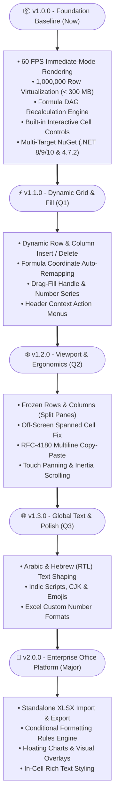

# DevBrewLabs.WPF.Spreadsheet - Roadmap

```mermaid
flowchart TD
    %% Phase 1
    M1(["📦 v1.0.0 - Foundation Baseline (Now)"])
    D1["• 60 FPS Immediate-Mode Rendering\n• 1,000,000 Row Virtualization (< 300 MB)\n• Formula DAG Recalculation Engine\n• Built-in Interactive Cell Controls\n• Multi-Target NuGet (.NET 8/9/10 & 4.7.2)"]
    M1 --> D1

    %% Phase 2
    M2(["⚡ v1.1.0 - Dynamic Grid & Fill (Q1)"])
    D2["• Dynamic Row & Column Insert / Delete\n• Formula Coordinate Auto-Remapping\n• Drag-Fill Handle & Number Series\n• Header Context Action Menus"]
    M2 --> D2

    %% Phase 3
    M3(["❄️ v1.2.0 - Viewport & Ergonomics (Q2)"])
    D3["• Frozen Rows & Columns (Split Panes)\n• Off-Screen Spanned Cell Fix\n• RFC-4180 Multiline Copy-Paste\n• Touch Panning & Inertia Scrolling"]
    M3 --> D3

    %% Phase 4
    M4(["🌐 v1.3.0 - Global Text & Polish (Q3)"])
    D4["• Arabic & Hebrew (RTL) Text Shaping\n• Indic Scripts, CJK & Emojis\n• Excel Custom Number Formats"]
    M4 --> D4

    %% Phase 5
    M5(["🚀 v2.0.0 - Enterprise Office Platform (Major)"])
    D5["• Standalone XLSX Import & Export\n• Conditional Formatting Rules Engine\n• Floating Charts & Visual Overlays\n• In-Cell Rich Text Styling"]
    M5 --> D5

    %% Release Progression
    D1 ==> M2
    D2 ==> M3
    D3 ==> M4
    D4 ==> M5
```
